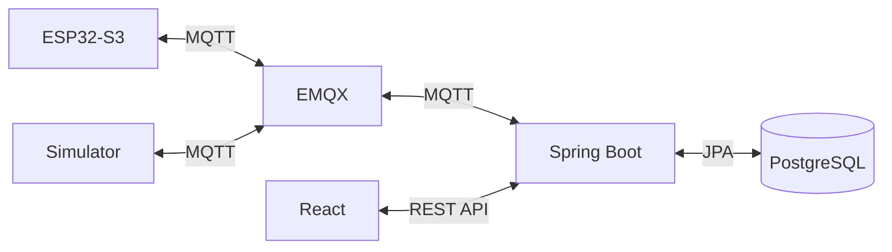

# Kiến trúc

## Luồng telemetry

ESP32 đọc DHT22 và cảm biến ánh sáng mỗi 5 giây, tự điều khiển đèn/relay rồi publish `iot/{deviceId}/telemetry`. Spring Boot subscribe topic, cập nhật trạng thái thiết bị và lưu lịch sử vào PostgreSQL. React polling REST API mỗi 5 giây.

## Luồng command

React gọi `POST /api/v1/devices/{deviceId}/commands`. Backend lưu command, publish `iot/{deviceId}/command`; ESP32 thực thi và publish ACK lên `iot/{deviceId}/command/ack`. Backend dùng ACK để cập nhật trạng thái đèn/còi.

## Online/offline

ESP32 publish retained status `ONLINE` tại `iot/{deviceId}/status`. EMQX tự publish Last Will `OFFLINE` khi thiết bị mất kết nối.
